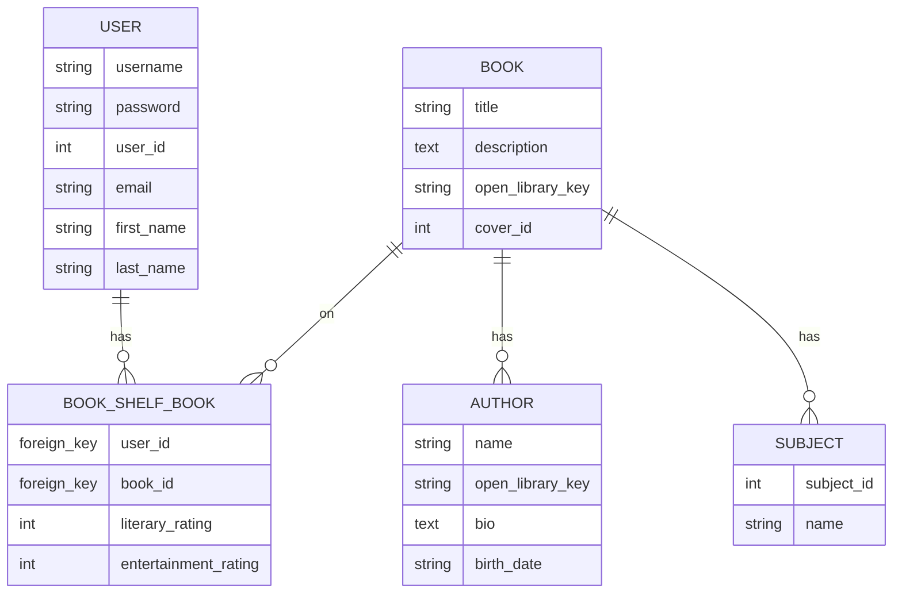

# RAG Book APP

A personalized book recommendation app powered by a RAG chatbot.

## Features

- chatbot - user query + user book ratings (bookshelf data) -> GPT -> structured JSON recommendations
- Open Library integration with "lazy-fetch: DB caching (saves books, authors to db after first retrieval from API)
- Dual rating system, for users to differentiate between how well written a book was from their enjoyment (enjoyment + literary ratings)
- Json Web Token-based auth (registration, login, logout)
- RESTful API with public browse + authenticated chatbot

## Tech Stack

| Category       | Technology                              |
|----------------|-----------------------------------------|
| Framework      | Django 6.0.2                            |
| API            | Django REST Framework 3.16.1            |
| AI/LLM         | OpenAI SDK 2.20.0 (gpt-5-nano)         |
| Database       | PostgreSQL (psycopg)       |
| Auth           | dj-rest-auth + django-allauth    |

## Architecture

### Fetch if not Found

To reduce reliance on the Open Library API, attempts to retrieve book or author data from the database first when accessing a specific work. If not present, will fetch the necessary data from Open Library and save it to the database.

### RAG Flow

The first, and simplest version as of now:
user query + user book rating data (bookshelf data) -> system prompt + user prompt -> GPT Responses API -> structured JSON output

### Current Database Schema



## API Endpoints

| Method | Endpoint                          | Auth            | Description                          |
|--------|-----------------------------------|-----------------|--------------------------------------|
| GET    | `/api/book/works/<pk>/`           | Public          | Book detail (fetches from OL if new) |
| GET    | `/api/book/authors/<pk>/`         | Public          | Author detail (fetches from OL if new)|
| GET    | `/api/search/?q=&page=&limit=`    | Public          | Search Open Library                  |
| POST   | `/api/chatbot/single-message/`    | Authenticated   | Get AI book recommendations, send query in data          |
| POST      | `/api/dj-rest-auth/`              | Varies          | Login, logout, password              |
| POST      | `/api/dj-rest-auth/registration/` | Varies          | User registration                    |

## Getting Started

- Prerequisites: Python 3.x, PostgreSQL, OpenAI API key
- Clone -> venv -> `pip install -r requirements.txt` -> create DB -> `.env` -> migrate -> runserver
- Link to full [Dev Notes](book_rag_backend/docs/dev_notes.md)

## Environment Variables

| Variable         | Purpose                                    |
|------------------|--------------------------------------------|
| `DBNAME`         | PostgreSQL database name                   |
| `DBUSER`         | PostgreSQL username                        |
| `DBPASSWORD`     | PostgreSQL password                        |
| `DBHOST`         | PostgreSQL host                            |
| `DBPORT`         | PostgreSQL port                            |
| `OPENAI_API_KEY` | OpenAI API key for chatbot                 |
| `MYAPPNAME`      | User-Agent app name for Open Library API   |
| `MYEMAIL`        | User-Agent contact email for Open Library  |

## Running Tests

```console
python manage.py test
```

Covers API views (book, author, search), chatbot services, chatbot views
Uses dummy data to avoid actual API calls

## Links

- Design decisions [Design Docs](book_rag_backend/docs/design_decisions.md)
- Dev Setup [Dev Setup](book_rag_backend/docs/dev_setup.md)
