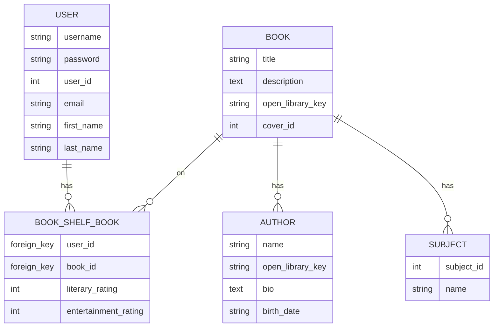
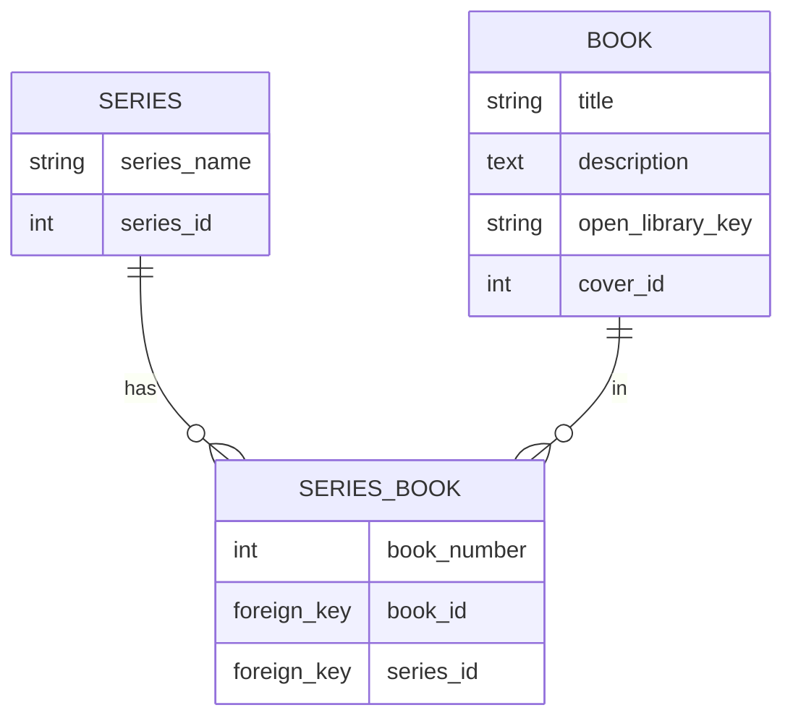

# Design Decisions

## Open Library Integration Strategy

### Important Considerations

- The dump data provided yearly is too large for a personal project and my current costs.
- Open Library asks to cache data to prevent too many calls

### My Integration

- Cache Book, Author data in database after first retrieval from Open Library
- View firsts checks database for object with given key, then retrieves from Open Library
- Open Library Key as primary key, allowing same key for database lookup or API call
- Calls to Open Library have user-agent headers with app name/email
- Django Management script using a list of keys to get info for dummy test data, 1s sleep in consideration of Open Library

## Data Model Choices

- 'Book' and 'Author' user 'open_library_key' as PK, maps 1:1 with Open Library simplifying lookup
- M2M 'Author <-> Book'
- Separate 'Subject' model with M2M - flexible tagging
- 'BookshelfBook' - dual rating (enjoyment vs literary) for richer user preference
- 'AuthorWorksPaginationCache' - OneToOne with Author, stores paginated works as ArrayField, only present for current implementation that caches Open Library data in order to allow Author details to display their works without needing to collect each works data from Open Library

## Chatbot Architecture

Implemented:

- [x] version 0.1
- [ ] version 0.2

### Version 0.1

- Single-shot design (no conversation history), simple, stateless version
- OpenAI Responses API, utilizing structured JSON Schema
- User book ratings + titles serialized into prompt with user query

## Authentication

- JSON Web Token auth + session auth (DRF)
- dj-rest-auth + django-allauth for REST auth flows
- Permission strategy: public book/author/search, authenticated chatbot onlyu

## Database Diagrams

Current models:

Future planned models:

## Future Considerations

- Implement Async for Views like Chatbot
- Chatbot User Data and Similar User Data filtering implementation (0.2)
- pgvector to utilize PostgreSQL as a vector database for semantic search with chatbot (v0.3)
- Full OL data dump feasibility (v0.4)
