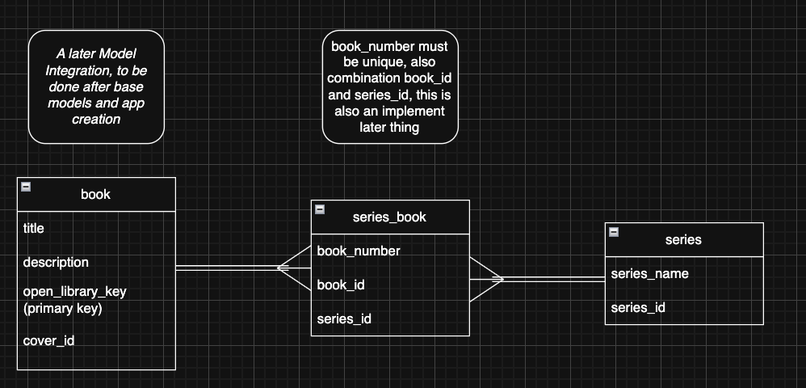

# Development Notes

- [Technologies to use](#technologies-to-use)
- [Notes on Technology](#notes-on-technology)
- [Tasks](#tasks)
- [Considerations](#considerations)
- [Immediate to Do](#immediate-to-do)
- [lower priority to do](#lower-priority-to-do)
- [OpenLibrary notes](#openlibrary-notes)

- [Database Diagram](#database-diagram)

- [Chatbot Development Phases](#chatbot-development-phases)

## Technologies to use

- PostgreSQL
- Docker (?)
- REST Framework
- Open Library API/Data

### Notes on Technology

PsostgreSQL uses psycopg3 (referred to as psycopg) for database interactions not included with django

## Tasks

- Create test code for practicing testing
- Develop API schema for interactions

## Considerations

- Consider using Celery to handle async tasks. For testing the API chatbot, it's not needed yet, but with multiple users, async handling for fetching data from the database, utilizing it, and sending it to the chatbot takes time.

## Remember

When I feel friction, or something feels hard, stop, be present, and learn. If something is hard, or feels unintuitive, it doesn't fit into the pattern I know, or I lack information. It's time to targeted learn then, compare what i was working on to other's code, look up tutorials with similar things I can apply, look at docs, use AI too search for similar things to save time in searching. Take a moment, be present, and learn, and remember, I need to take what is unintuitive and learn its pattern, how it connects to what I know.
Make a mindmap of something new when making it, see how it connects

## Immediate to Do

### Top to Do

- [ ] Integrate chatbot API
- [ ] RAG system development v0.1

### Specific To Do

- [x] integrate PostgreSQL to be used first
- [x] double check if I need to use a custom user type (i don't think so)
- [x] make apps for models
  - [x] Books app
  - [x] Chatbot app
  - [x] Api app
- [ ] make authentication login/logout for django
- [ ] make api views for things like books
  - [ ] book and author singleton view, with retrieval from open library when nonexistent and saving to database
    - [x] mixins to allow api retrieval
    - [x] integrate mixins into API View Class
    - [ ] author works pagination cache model works, to compensate for lack of total database data
      - [ ] allows selection of how many works for pagination
      - [ ] caches only if works exist in open library response
      - [ ] will attempt to give db saved pagination first
    - [ ] make an actual Async version fo the class
    - [ ] error handling
    - [x] test code for create and retrieval using view
      - [x] retrieves normally when in database
      - [x] retrieves dummy data when not in database, creates and adds and returns data, mocking the method to not use real one
      - [x] gets author data when new book is added if author doesn't exist
      - [x] uses previously existing author data when new book is added if author exists
      - [x] when author is created by itself, doesn't create book
      - [x] fetches author from db when exists, fetches from api when doesn't
      - [ ] author book pagination view
      - [ ] async test, make separate test file that doesn't normally run with all tests, only when explicitely run (due to async api calls with open library)

  - [x] search that uses openapi library batch.json search
- [ ] make schema for chatbot api
- [ ] integrate it like in my test app i did
- [x] look into using either google books or open library for search
- [ ] make dummy data of books, allow saving to database if dummy data doesn't already exist when a user saves the book/likes/rates (don't want to use api calls for every interaction)
- [ ] make specific views for homepage, book search api, chatbot

### lower priority to do

- [ ] psycopg2 is marked in the DATABASES engine area for settings, look into psycogp3
- [ ] use different credentials for .env when using a production server, for every variable
- [x] edit the models diagrams to better mimic the edits to the modesl in books
- [ ] make list of libraries used asides just the requirements.txt, some are installed as part of other libraries some aren't like dj-rest-auth and django-allauth

## OpenLibrary Notes

<!-- Open library provides data dumps, all info on the current data is only 12.9 gigabytes
Given this, pull only fantasy/sci-fi/horror/speculative fiction entries from it and their authors to save on data size. -->
Actually, just take open library search, integrate it, and when a page is clicked, attempt to retrieve info from my database first. if it doesn't exist, call open library to get meta data, get it and save it to db, then provide info to the user

Search: Open Library query
Individual book page: check my db first, if not there open library data request, save the data

If a user rating/bookshelf model exists, then it will have a corresponding entry in the database. So any info that needs to be passed to the chatbot based on user data will exist and be available.

also cache author models the same way, when a book or an author is clicked

Open library uses /works/OL*** and /authors/OL*** as keys, consider either removing the front and saving to model like that, or keeping as whole and partly using keys in determining the url path.
For now, going with latter of keeping it in the key

## Database Diagram

Diagrams are prepared using the site draw.io

Current Models:

Future Model Considerations:

## Chatbot Development Phases

### v0.1

#### Only User Data

Make the chatbot:

- [ ] basic communication with ChatGPT
<!-- - [ ] Conversation flow (how many queries? cach last context sent? leave that for front end?) -->
<!-- look into conversation id again for chatgpt -->
- [ ] implement single shot for now, query response no follow up
- [ ] Post Json Schema
- [ ] ChatGPT response Schema

- [ ] Implement JWT verification for users

- [ ] Implement View
- [ ] If logged in, use user data, pass to gpt

Search Version:

- [ ] Users input keyword, open library is searched, results and user data handed to gpt for recommendation

### v0.2

#### Similar User Data Included

- [ ] search for similar ratings for the same books from other users for liked books
- [ ] start with >3 books from query user, keep it simple first
- [ ] filter for users who have many liked books in common, providing books the querying user hasn't read
- [ ] hand book rating data over as 'user data' and 'similar user data'

### v0.3

#### Vector Database, Embeddings

- [ ] postgres pgvector
- [ ] pgvector semantic search
- [ ] vector embeddings to book model using descriptions + title + subjects
- [ ] text-embedding-3-small (look into)

### v0.4

#### use all open library data

- [ ] make a separate branch purely for this, will probably have enough data it's too expensive to host as hobby project
- [ ] buy external drive to hold data
- [ ] store on database in that drive, adding on vector embeddings
- [ ] change search to use the db from it
- [ ] write a blog post about it and what I learned

### For all versions:

- [ ] create 3-5 test user profiles, go over preferences
- [ ] verify recommendations for each
- [ ] store results of each version, compare when new version is done
