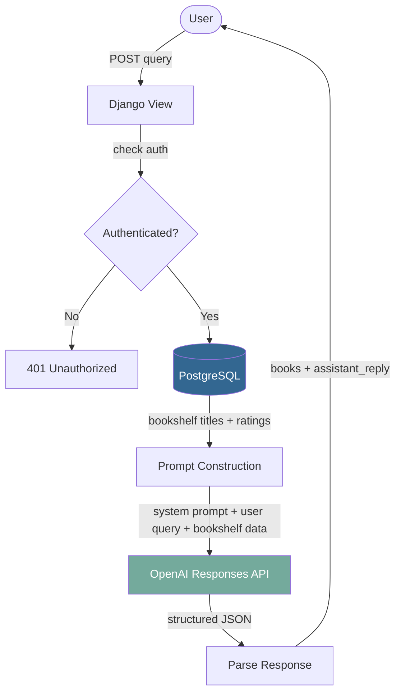
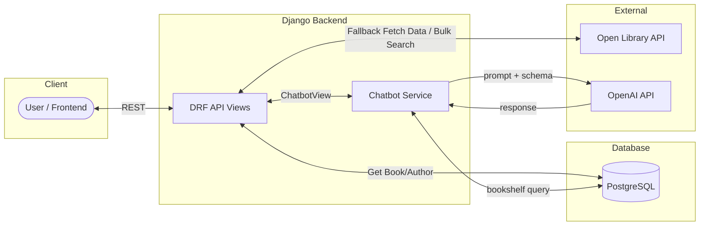

```mermaid
flowchart TD
    A([User]) -->|POST query| B[Django View]
    B -->|check auth| C{Authenticated?}
    C -->|No| D[401 Unauthorized]
    C -->|Yes| E[(PostgreSQL)]
    E -->|bookshelf titles + ratings| F[Prompt Construction]
    F -->|system prompt + user query + bookshelf data| G[OpenAI Responses API]
    G -->|structured JSON| H[Parse Response]
    H -->|books + assistant_reply| A

    style G fill:#74aa9c,color:#fff
    style E fill:#336791,color:#fff
```

```mermaid
flowchart LR
    subgraph Client
        A([User / Frontend])
    end
    subgraph Django["Django Backend"]
        B[DRF API Views]
        C[Chatbot Service]

    end
    subgraph Database
        D[(PostgreSQL)]
    end
    subgraph External
        direction TB
        E[Open Library API]
        F[OpenAI API]
    end

    A <-->|REST| B
    B <-->|ChatbotView| C
    B <-->|Get Book/Author| D
    B <-->|Fallback Fetch Data / Bulk Search| E
    C <-->|bookshelf query| D
    C -->|prompt + schema| F
    F -->|response| C
```
